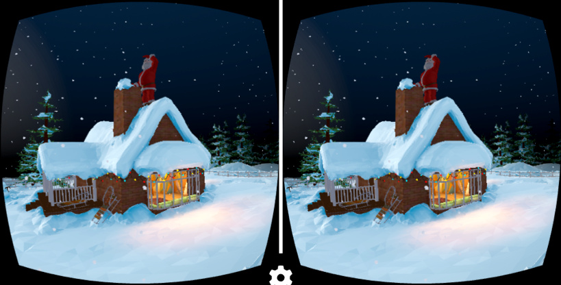

# Xmas WebVR Adventure

Verge3D Christmas demo with VR capabilites. This application was designed by Soft8Soft for Christmas 2018. Software used: Verge3D 2.10, Blender 2.79.

We had no time to update it to Blender 2.80 (Eevee), so it still uses Blender Internal nodes. As such, it's not compatible with latest versions of Verge3D.

Still, for historical reasons, I've recovered this awesome app and uploaded it on GitHub. It's still runnable, but no VR though.

[Enjoy](https://alexkowel.github.io/xmas_vr/xmas_vr.html)!
